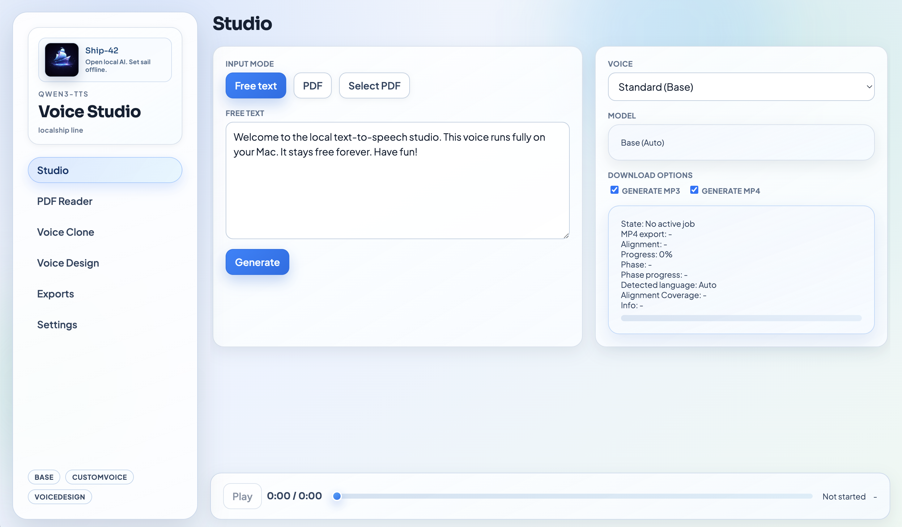

# Ship-42 Local Voice Studio (Qwen3-TTS Desktop, Electron + MLX)

Open local AI solution by **Ship-42**.



Local-first desktop app with a minimal ElevenLabs-like workflow:

- Studio for free text + PDF jobs
- Automatic language detection
- Streaming playback via chunk events
- PDF reader with word-level highlight
- Voice library with encrypted local storage (AES-GCM)
- MP3 export (192k)
- MP4 export (1080p30) with karaoke word highlighting
- Dedicated model download controls in Settings
- No cloud login required

## Stack

- Electron (main/preload)
- React + TypeScript + Vite (renderer)
- Python FastAPI service (localhost)
- Queue worker with concurrency=1
- FFmpeg-based export pipeline

## Model Strategy

By default, each model ID maps to MLX-community 8bit repos:

- `base` -> `mlx-community/Qwen3-TTS-12Hz-1.7B-Base-8bit`
- `customvoice` -> `mlx-community/Qwen3-TTS-12Hz-1.7B-CustomVoice-8bit`
- `voicedesign` -> `mlx-community/Qwen3-TTS-12Hz-1.7B-VoiceDesign-8bit`

The backend auto-attempts model download into local cache on first use.

## Important Runtime Note

MLX is the primary runtime. The app verifies that `mlx-audio` supports `qwen3_tts`.

- If compatible: synthesis runs on MLX.
- If incompatible and fallback is disabled (default): jobs fail with a fix hint.
- If incompatible and fallback is enabled in Settings: jobs fall back to macOS `say`.

If your FFmpeg build does not include `ass` subtitle filters, MP4 export falls back to an image-based karaoke renderer using the same word timeline.

Qwen3 runtime support in `mlx-audio` follows the upstream implementation:
[Blaizzy mlx-audio qwen3_tts README](https://github.com/Blaizzy/mlx-audio/blob/main/mlx_audio/tts/models/qwen3_tts/README.md)

## Local-only Behavior

- No external TTS inference API is used.
- Synthesis runs locally on your Mac (MLX).
- Hugging Face is used only for model file downloads (first run / missing cache).
- After models are downloaded, generation is offline-first.

For Voice Clone, add a **Reference text** in the Voices page when possible.
This avoids automatic STT transcription downloads during cloning.

## Runtime packages (pinned)

Install pinned MLX runtime packages from this repo:

```bash
source runtime/.venv/bin/activate
pip uninstall -y mlx-lm mlx-audio
pip install --upgrade --force-reinstall -r python_service/requirements-mlx.txt
```

`mlx-lm` is intentionally removed for this runtime because it currently conflicts with the
`mlx-audio` Qwen3 dependency set.

Word alignment uses local WhisperX forced alignment. Alignment models are stored in
`runtime/models/whisperx` and can be preloaded from **Settings**.
If `runtime/.venv-align` is missing, the **Alignment model (WhisperX)** download action
will try to bootstrap that runtime automatically.
The alignment worker loads `whisperx.alignment` and `whisperx.audio` only (no VAD/diarization path).

## Prerequisites

- macOS ARM64 (Apple Silicon)
- Node.js >= 20
- Python >= 3.11
- `ffmpeg` + `ffprobe`

## Install

```bash
# Run from the current project folder
npm install
python3 -m venv --clear runtime/.venv
source runtime/.venv/bin/activate
pip install -U pip
pip install -r python_service/requirements.txt
python -m pip uninstall -y mlx-lm mlx-audio
python -m pip install --upgrade --force-reinstall -r python_service/requirements-mlx.txt
python -m pip check
python -c "import importlib.metadata as m; print('mlx-audio', m.version('mlx-audio'))"
python -c "import pkgutil, mlx_audio.tts.models as mm; print('qwen3_tts' in [mod.name for mod in pkgutil.iter_modules(mm.__path__)])"
deactivate

python3 -m venv --clear runtime/.venv-align
source runtime/.venv-align/bin/activate
pip install -U pip
pip install --upgrade --force-reinstall -r python_service/requirements-align.txt
deactivate
```

If you had older experiments in the same `.venv`, keep `--clear` to avoid stale dependency conflicts.

Electron prefers `runtime/.venv/bin/python3` automatically (falls back to `python3` if missing).
Alignment uses `runtime/.venv-align/bin/python3`.

## Self-contained storage

Runtime data is stored inside this repository folder:

- `runtime/models` (model cache/downloads, including WhisperX alignment models)
- `runtime/outputs` (jobs, assets, exports, voices)
- `runtime/config` (local app config + encrypted voice-secret blob)
- `runtime/tmp` (temporary render/synthesis files)

Sandbox rule: everything is intentionally kept inside the current project folder.

## Run (development)

```bash
npm run dev
```

This starts:

- Vite renderer on `http://127.0.0.1:5173` (or the next free local port)
- Electron desktop shell
- Python API service on `http://127.0.0.1:8765` (spawned by Electron main process)

## Run (built app)

```bash
npm run build
npm run start
```

`npm run build` only builds the renderer. It does not launch the app by itself.

## API (local service)

- `POST /v1/jobs/text`
- `POST /v1/jobs/pdf`
- `GET /v1/jobs`
- `GET /v1/jobs/{jobId}`
- `GET /v1/jobs/{jobId}/events` (SSE)
- `GET /v1/assets/{assetId}`
- `GET /v1/voices`
- `POST /v1/voices`
- `PATCH /v1/voices/{voiceId}`
- `DELETE /v1/voices/{voiceId}`
- `POST /v1/voices/preview`
- `GET /v1/runtime`
- `POST /v1/jobs/{jobId}/language`

## MLX Runtime Verify / Troubleshooting

1. Open **Settings** and click **Verify runtime**.
2. If you see `qwen3_tts not supported`:

```bash
# Run from the current project folder
source runtime/.venv/bin/activate
python -m pip uninstall -y mlx-lm mlx-audio
python -m pip install --upgrade --force-reinstall -r python_service/requirements-mlx.txt
python -c "import importlib.metadata as m; print('mlx-audio', m.version('mlx-audio'))"
python -c "import pkgutil, mlx_audio.tts.models as mm; print('qwen3_tts' in [mod.name for mod in pkgutil.iter_modules(mm.__path__)])"
```

3. Restart `npm run dev` and verify runtime again.

### Alignment runtime troubleshoot

If alignment fails with missing WhisperX runtime:

```bash
# Run from the current project folder
source runtime/.venv-align/bin/activate
python -m pip install --upgrade --force-reinstall -r python_service/requirements-align.txt
python -m pip check
```

Then open **Settings** and download **Alignment model (WhisperX)**.
If it still fails, use the exact `Alignment reason` / `Probe error` shown in Settings runtime status for diagnosis.

You can also trigger this from **Settings** directly: the app attempts to prepare
`runtime/.venv-align` and then downloads WhisperX alignment models.

## UI Pages

- Studio
- PDF Reader
- Voice Clone
- Voice Design
- Exports
- Settings

## Tests

```bash
source runtime/.venv/bin/activate
pytest python_service/tests
```

## GitHub metadata (suggested)

- Owner: `Ship-42`
- Name: `local-voice-studio` (or your preferred repo name)
- Description:
  `Local-first Text-to-Speech Studio for Apple Silicon (Electron + MLX + Qwen3 + WhisperX). Voice clone, voice design, PDF reader, MP3/MP4 karaoke export.`
- Topics:
  `local-ai, text-to-speech, qwen3, mlx, whisperx, electron, apple-silicon, pdf, karaoke, voice-clone`
- Website (optional):
  link to your Ship-42 profile or docs page

## Publish checklist

```bash
# Run in this project folder
npm run build
source runtime/.venv/bin/activate
pytest python_service/tests
```

Then create/push your GitHub repo and make sure local runtime data is not committed
(`runtime/`, local venvs, caches, outputs are ignored by `.gitignore`).

## License

MIT. See `LICENSE`.

## Security

- Voice reference files are encrypted at rest with AES-GCM.
- Encryption key is generated by Electron and stored using `safeStorage` when available.

## Project Layout

- `electron/main.cjs` Electron lifecycle, secure IPC, Python service launcher
- `electron/preload.cjs` context bridge for renderer
- `src/` React renderer pages/components/state
- `python_service/app/main.py` FastAPI entry
- `python_service/app/manager.py` queue worker and job orchestration
- `python_service/app/tts_engine.py` model handling + synthesis backend adapter
- `python_service/app/exporters.py` mp3/mp4/alignment exports
